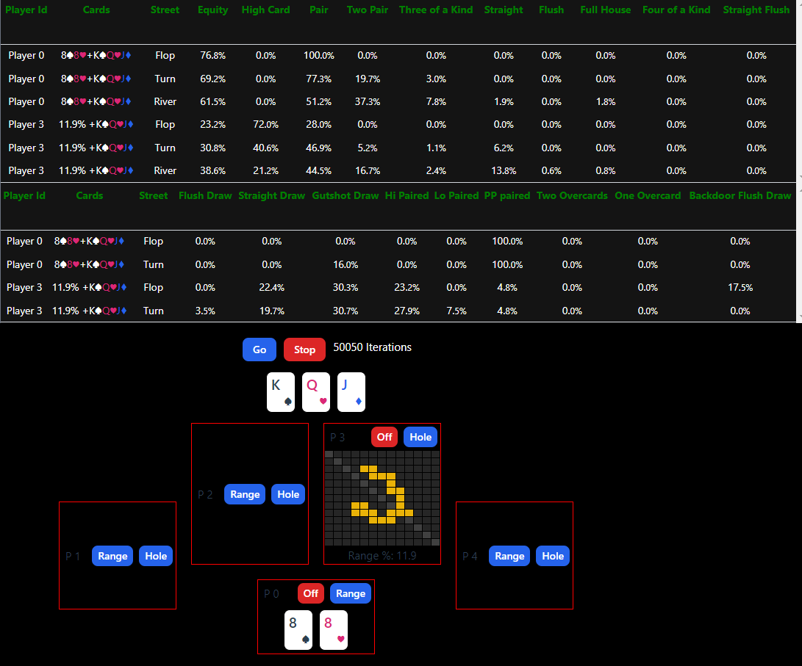

# Rust Wasm Poker Evaluatior 


Equity and Draw Analysis.  Try it out on [Github pages](https://eric7237cire.github.io/)

## Tech Stack

*  Rust
*  Vue3

## Screenshot



## Credits

### Wasm Postflop

Used UI components and the Range class of https://github.com/b-inary/wasm-postflop

Used same worker/Wasm architecture

### Rust Poker 

Used core classes and ranking from https://github.com/elliottneilclark/rs-poker

### Comlink

Web Worker <=> App communication 

https://github.com/GoogleChromeLabs/comlink

## Dev

### Prereqs

Install rust & wasm pack.

For example:

``` 
curl --proto '=https' --tlsv1.2 -sSf https://sh.rustup.rs | sh
curl https://rustwasm.github.io/wasm-pack/installer/init.sh -sSf | sh
```

This will watch rust & vue files
```
cd vue-poker
npm install
npm run r-dev
```

## Tests

```
cd rust
cargo test
```